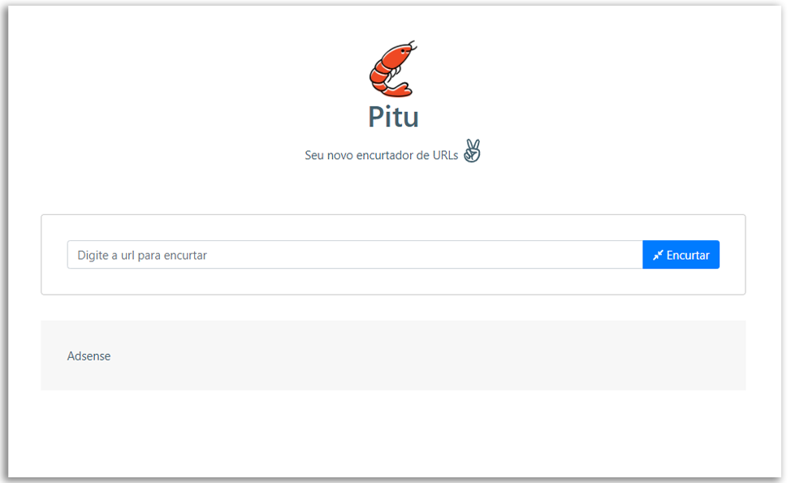

<h1 align="center">
    
    <br>Semana Full Stack JS<br/>
    Node.js | ReactJS | MySQL
</h1>

<p align="center">
    
    
    <br/>
</p>

<p align="center">
    &nbsp;&nbsp;&nbsp;|&nbsp;&nbsp;&nbsp;<a href="http://www.pitu.link">Pitu URL Shortener</a>&nbsp;&nbsp;&nbsp;|&nbsp;&nbsp;&nbsp;
</p>

<p align="center">
    
<p>

## Sobre o Projeto

O *Pitu* é uma aplicação micro-SaaS pensada para, de forma simples e fácil, encurtar e vizualizar estatíticas de uma URL.

## *Mas, por que Pitu??*

O Pitu é considerado o maior camarão de água doce podendo chegar a medir quase 50 centímetros, porém ele nasce muito pequeno.

Esta ideia de nascer pequeno e se tornar grande, é justamente a ideia de nosso projeto. Onde um usuário com uma URL encurtada (pequena)
pode acessar um site cuja URL seja muito maior.

Este projeto foi proposto durante a *Semana Full Stack JS*, projeto do professor [Luiz Duarte](https://www.luiztools.com.br). 


## Tecnologias Utilizadas

-  [Axios](https://github.com/axios/axios)
-  [Date-fns](https://date-fns.org/)
-  [Express](https://expressjs.com/)
-  [MySQL](https://www.mysql.com/)
-  [Node.js](https://nodejs.org/en/)
-  [NPM](https://www.npmjs.com/)
-  [React Bootstrap](https://react-bootstrap.github.io/)
-  [ReactJS](https://reactjs.org/)
-  [SCSS](https://sass-lang.com/)
-  [Styled Components](https://styled-components.com/)
-  [Typescript](https://www.typescriptlang.org/)
-  [Yarn](https://yarnpkg.com/)

## Como Executar o Projeto

- ### *Pré-requisitos*

  - É *necessário* possuir o **[Node.js](https://nodejs.org/en/)** instalado no computador.
  - É *necessário* possuir o **[Git](https://git-scm.com/)** instalado e configurado no computador.
  - Também, é *preciso* ter um gerenciador de pacotes seja o **[Yarn](https://yarnpkg.com/)** ou **[NPM](https://www.npmjs.com/)**.
  - Por fim, é *essencial* ter o **[MySQL](https://www.mysql.com/)** instalado na máquina.

1. Faça um clone do repositório:

```sh
  $ git clone https://github.com/WernerLuiz92/URL_Shortener_Pitu.git
```

2. Executando a Aplicação:

```sh
  # API
  $ cd backend
  # Instalando as dependências do projeto.
  $ npm install # yarn install
  # Inicie a API
  $ npm start # ou yarn start

  # CONEXÃO COM BANCO DE DADOS MYSQL
  # backend > database.ts
  # mysql://<USUARIO>:<SENHA_MY_SQL>@<SUA_URL>:3306/<NOME_DO_BANCO_DE_DADOS>

  # APLICAÇÃO WEB
  $ cd frontend
  # Instalando as dependências do projeto.
  $ yarn install # ou npm install
  # Inicie a aplicação web
  $ yarn start # ou npm start
```

## Licença


Esse projeto está sob a licença MIT. Veja o arquivo [LICENSE](LICENSE) para mais detalhes.<br />


---
<sup>Projeto desenvolvido com a tutoria de [Luiz Duarte](https://github.com/luiztools), da [LuizTools](https://www.luiztools.com.br).</sup>
